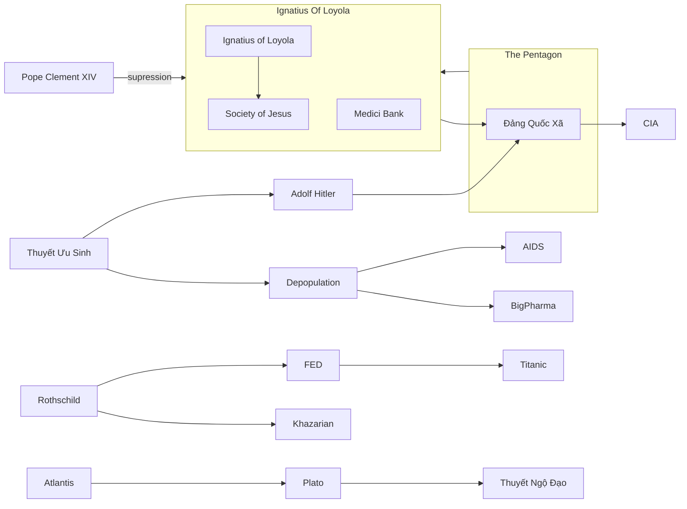

---
outgoing_links:
  - Zet/Lucifer
  - Zet/People/Donald J. Trump
  - Zet/People/Nicola Tesla
  - Zet/Atlantis
  - Zet/People/Plato
  - Zet/People/Helena Blavatsky
  - Zet/Crop Circle
  - Zet/Dòng Tên
  - Zet/People/Đức Giáo Hoàng
  - Zet/Eugenics
backlinks:
  - Zet/People/Plato
  - Zet/People/Đức Giáo Hoàng
  - Zet/People/Helena Blavatsky
title: QAnon map
UID: 210920220953
created: 20-Sep-2021
tags:
  - '#created/2021/Sep/20'
  - '#garden🏡'
  - '#permanent/concept'
aliases:
  - Qanon map
publish: True
---
# QAnon map

## Notes:
![[Pasted image 20211016215716.png]]

## Un-category:
- [[Lucifer]]
- [[Satanism]]
- [[Seraphim]]
- [[The Great Awakening]]
- [[Công Đồng Nicea 325]]
- [[Vatican]]
- [[Donald J. Trump]]
- [[Pizzagate]]
- [[Black Lives matter]]
- [[The Great Awakening]]
- [[Wikileaks]]
- [[Khazars]] bộ lạc thứ 13
- [[Rothschild bank]]
- [[Moloch]]
- [[Thẻ bài Illuminati]]
- [[Chiến tranh Việt Nam|Vietnam War]]
- [[Titanic]]
- [[John D. Rockefeller]]
- [[The Rockefeller Foundation]]
- [[Nicola Tesla]]
- [[Walt Disney]]
- [[Project Blue Book]]
- [[@ Aldous Huxley, Brave New World]]
- [[Henry Ford]]
- [[Israel]]
- [[Knights Templar]]
- [[Mahattan Project]]
- [[Hiroshima và Nagasaki]]
- [[The Cold War]]
- [[Atlantis]]
- [[Lục địa Lemuria|Lemuria]]
- [[Plato]]
- [[George W. Bush]]
- [[Sự kiện 11-09]]
- [[Bill Clinton]]
- [[Hillary Clinton]]
- [[Thuyết Ngộ Đạo|Gnosticism]]
- [[Tháp Mentmore]]
- [[Chủ Nghĩa Zion]]
- [[New World Order]]
- [[Black nobility]]
- [[Helena Blavatsky]]

### Lịch/Thời gian
- [[Enki]] hay còn gọi là thần Ea -> [[Gold mines of Enki]] 
- [[Lịch Adam]]
- [[Stonehenge]]

### [[Pharaon]]
![[Pasted image 20211026232120.png]]
- [[Nữ thần ISIS]]
- [[Thần RA]]
- [[Thuyết nguyên tử|Atonism]]

### [[Elon Musk]]
- [[Nicola Tesla|Tesla]]
- [[Paypal]]
- [[SpaceX]]
- [[Hyperloop]]

### Aliens
- [[Sự kiện Roswell|Roswell 1947]]
- [[Acient Aliens]]
- [[Anunnaki]]
- [[Crop Circle]]

### [[Jeff Bezos]]
- [[Amazon]]
- [[Wholefoods]]
- [[The Washington Post]]

### [[Mark Zuckerberg]]
- [[facebook]]

### [[USSR]]
- [[Lenin]]
- [[Stalin]]
- [[Marxism]]
- [[Cách mạng tháng 10]]

### [[Ignatius of Loyola]]
- [[Dòng Tên]]
- [[Grey Pope]] -> [[Orsini family|Orsini]]
- [[Bề trên tổng quyền Dòng Tên|Black Pope]] là biệt danh [[Bề trên tổng quyền Dòng Tên]] 
- [[Đức Giáo Hoàng|White Pope]] -> Người đứng đầu [[Vatican]] tức [[Đức Giáo Hoàng]]
- [[Pope Clement XIV]] -> [[Suppression of the Society of Jesus]]
- [[Medici Bank]]
- [[Pope Pius VII]] Khôi phục [[Dòng Tên]] 1814
- Breakspear

### [[Eugenics]]
- [[Adolf Hitler]]

## Mermaid Graph

## Backlinks:
- [[Plato]]
- [[Đức Giáo Hoàng]]
- [[Helena Blavatsky]]
