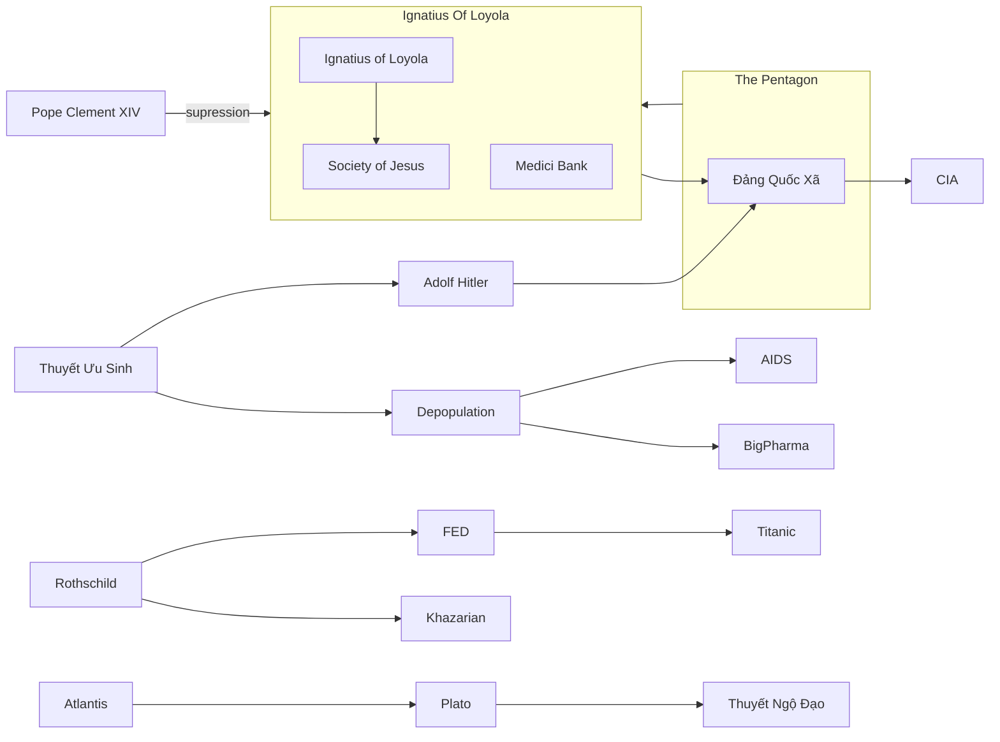

---
outgoing_links:
  - Zet/QAnon
  - Zet/Lucifer
  - Zet/Satanism
  - Zet/Công Đồng Nicea 325
  - Zet/Vatican
  - Zet/People/Donald J. Trump
  - Zet/Khazars
  - Zet/Chiến tranh Việt Nam
  - Zet/Titanic
  - Zet/Hiệp sĩ Đền Thánh
  - Zet/Atlantis
  - Zet/Lục địa Lemuria
  - Zet/Thuyết Ngộ Đạo
  - Zet/Tháp Mentmore
  - Zet/Chủ Nghĩa Zion
  - Zet/New World Order
  - Zet/Black nobility
  - Zet/People/Helena Blavatsky
  - Zet/Vril
  - Zet/Akashic records
  - Zet/Janus
  - Zet/Hồi Giáo
  - Zet/People/Alberto Rivera
  - Zet/Thư viện Nag Hammadi
  - Zet/Các cuộn sách biển Chết
  - Zet/People/John Pierpont Morgan
  - Zet/Thảm họa Fukushima
  - Zet/People/Ronald Reagan
  - Zet/People/Anton Lavey
  - Zet/Gia tộc Rothschild
  - Zet/Khazarian Mafia
  - Zet/FED
  - Zet/People/Nicola Tesla
  - Zet/People/Plato
  - Zet/Plato có nói về Atlantis
  - Zet/Garden/Thần Enki
  - Zet/Nữ thần ISIS
  - Zet/Thần Ra
  - Zet/Anunnaki
  - Zet/Crop Circle
  - Zet/People/Joseph Stalin
  - Zet/Cách mạng tháng 10 Nga
  - Zet/People/Ignatius of Loyola
  - Zet/Dòng Tên
  - Zet/People/Đức Giáo Hoàng
  - Zet/Eugenics
  - Zet/People/Adolf Hitler
backlinks:
  - Zet/Plato có nói về Atlantis
  - Zet/Gia tộc Rothschild
  - Zet/Tháp Mentmore
  - Zet/Chủ Nghĩa Zion
  - Zet/Khazars
  - Zet/Công Đồng Nicea 325
  - Zet/Vril
  - Zet/Janus
  - Zet/People/Helena Blavatsky
  - Zet/People/Đức Giáo Hoàng
  - Zet/People/Plato
title: QAnon map
UID: 210920220953
created: 20-Sep-2021
tags:
  - 'created/2021/Sep/20'
  - 'garden🏡'
  - 'permanent/concept'
aliases:
  - Qanon map
publish: True
---
# Qmap

## Notes:
Qmap là một biểu đồ liệt kê rất nhiều thông tin, sự kiện bí ẩn trong lịch sử nhân loại có nguồn gốc từ [[QAnon]].

![[Pasted image 20211016215716.png]]

## Un-category:
- [[Lucifer]]
- [[Satanism]]
- [[Seraphim]]
- [[The Great Awakening]]
- [[Công Đồng Nicea 325]]
- [[Vatican]]
- [[Donald J. Trump]]
- [[Pizzagate]]
- [[Black Lives matter]]
- [[The Great Awakening]]
- [[Wikileaks]]
- [[Khazars]] bộ lạc thứ 13
- [[Rothschild bank]]
- [[Moloch]]
- [[Thẻ bài Illuminati]]
- [[Chiến tranh Việt Nam|Vietnam War]]
- [[Titanic]]
- [[John D. Rockefeller]]
- [[The Rockefeller Foundation]]

- [[Walt Disney]]
- [[Project Blue Book]]
- [[@ Aldous Huxley, Brave New World]]
- [[Henry Ford]]
- [[Israel]]
- [[Hiệp sĩ Đền Thánh]]
- [[Mahattan Project]]
- [[Hiroshima và Nagasaki]]
- [[The Cold War]]
- [[Atlantis]]
- [[Lục địa Lemuria|Lemuria]]
- [[George W. Bush]]
- [[Sự kiện 11-09]]
- [[Bill Clinton]]
- [[Hillary Clinton]]
- [[Thuyết Ngộ Đạo|Gnosticism]]
- [[Tháp Mentmore]]
- [[Chủ Nghĩa Zion]]
- [[New World Order]]
- [[Black nobility]]
- [[Helena Blavatsky]]
- [[Vril]]
- [[Vị tư tế tối cao của Amun]]
- [[Kinh Dịch]]
- [[Akashic records|Thư viện Akashic]]
- [[Thánh Phê Rô]]
- [[Janus]]
- [[Hồi Giáo]] created by [[Vatican]]
- [[Rev-02#v9]]
- [[Alberto Rivera]]
- [[Thư viện Nag Hammadi]]
- [[Nimrod]]
- [[Tháp Babel]]
- [[Thời kỳ Vệ Đà]]
- [[Các cuộn sách biển Chết]]
- [[John Pierpont Morgan]]
- [[Titanic]]
- [[Thảm họa Fukushima]]
- [[Ronald Reagan]]
- [[Anton Lavey]]
- [[Thẻ bài Illuminati]]
- 
## [[Gia tộc Rothschild|Rothschild]]
- [[Khazarian Mafia]]
- [[Tháp Mentmore|Mentmore tower]]
- [[FED|Federal Reserve System - FED]]

## [[Clinton Foundation]] 
- [[Hillary Clinton]]
- [[Bill Clinton]]
- [[Chicago Mob]] Mafia

## [[Nicola Tesla]]
- [[Nicola Tesla]] có liên hệ gì với [[Maria Orsic]]
- [[Maria Orsic]] là ai?

### [[Plato]]
![[Pasted image 20211027214850.png]]
- [[Atlantis]]
- [[Plato có nói về Atlantis]]

### Lịch/Thời gian
- [[Thần Enki]] hay còn gọi là thần Ea -> [[Gold mines of Enki]] 
- [[Lịch Adam]]
- [[Stonehenge]]

### [[Pharaon]]
![[Pasted image 20211026232120.png]]

- [[Nữ thần ISIS]]
- [[Thần Ra]]
- [[Thuyết nguyên tử|Atonism]]
- [[Biblical Kings]]
- 
### [[Elon Musk]]
- [[Nicola Tesla|Tesla]]
- [[Paypal]]
- [[SpaceX]]
- [[Hyperloop]]

### Aliens
- [[Sự kiện Roswell|Roswell 1947]]
- [[Acient Aliens]]
- [[Anunnaki]]
- [[Crop Circle]]

### [[Jeff Bezos]]
- [[Amazon]]
- [[Wholefoods]]
- [[The Washington Post]]

### [[Mark Zuckerberg]]
- [[facebook]]

### [[USSR]]
- [[Lenin]]
- [[Joseph Stalin]]
- [[Marxism]]
- [[Cách mạng tháng 10 Nga]]

### [[Ignatius of Loyola]]
- [[Dòng Tên]]
- [[Grey Pope]] -> [[Orsini family|Orsini]]
- [[Bề trên tổng quyền Dòng Tên|Black Pope]] là biệt danh [[Bề trên tổng quyền Dòng Tên]] 
- [[Đức Giáo Hoàng|White Pope]] -> Người đứng đầu [[Vatican]] tức [[Đức Giáo Hoàng]]
- [[Pope Clement XIV]] -> [[Suppression of the Society of Jesus]]
- [[Medici Bank]]
- [[Pope Pius VII]] Khôi phục [[Dòng Tên]] 1814
- Breakspear

### [[Eugenics]]
- [[Adolf Hitler]]

## Mermaid Graph

## Created:
- [[2021-09-20]]
